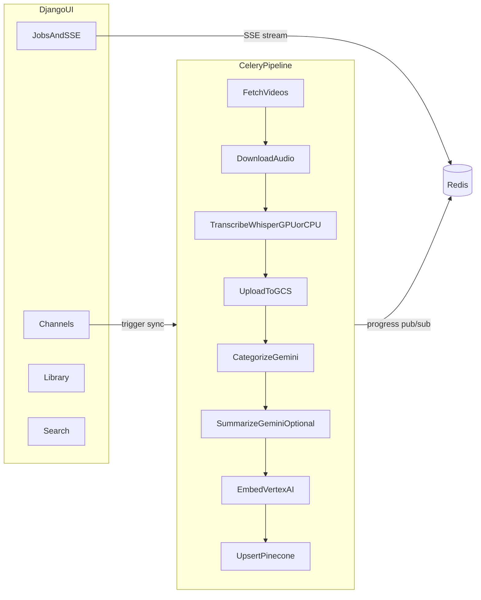

# ChannelMind

ChannelMind ingests YouTube channels and turns videos into searchable knowledge: download, transcribe, categorize, summarize, embed, and semantic search.

## Badges


## What It Does

- Discovers videos from one or more YouTube channels
- Downloads audio with `yt-dlp`
- Transcribes with `faster-whisper` (GPU or CPU)
- Uploads artifacts to Google Cloud Storage (GCS)
- Categorizes and optionally summarizes with Gemini
- Generates embeddings with Vertex AI
- Indexes vectors in Pinecone for semantic search
- Streams job progress live in the UI using SSE + Redis pub/sub

## Architecture



## Prerequisites

### Required for all setups

- Docker Desktop + Docker Compose
- Google Cloud service account key with access to GCS, Gemini, and Vertex AI
- Pinecone account and index (dimension `768` for `text-embedding-004`)

### Additional requirement for GPU setup

- NVIDIA drivers + NVIDIA Container Toolkit

## Quick Start (GPU)

```bash
cp .env.example .env
# Fill required values in .env
cp /path/to/your-sa-key.json secrets/sa.json
docker compose up --build
```

## Quick Start (CPU fallback)

Use the CPU override when contributors do not have an NVIDIA GPU/runtime:

```bash
cp .env.example .env
cp /path/to/your-sa-key.json secrets/sa.json
docker compose -f docker-compose.yml -f docker-compose.cpu.yml up --build
```

## Services and URLs

After startup:

- App UI: `http://localhost:9000`
- Django Admin: `http://localhost:9000/admin`
- Flower: `http://localhost:5555`

Containers started:

- `db` (`postgres:16`) local development database
- `redis` (`redis:7`) broker/result backend/pubsub
- `web` Django app (`gunicorn`)
- `worker` Celery worker for pipeline tasks
- `beat` Celery beat scheduler
- `flower` Celery monitoring UI

Migrations run automatically when the `web` container starts.

## Post-Startup Setup

Create a superuser:

```bash
docker compose exec web python manage.py createsuperuser
```

Create default categories (optional):

```bash
docker compose exec web python manage.py shell -c "
from apps.channels.models import Category
for name in ['Technology', 'Finance', 'Education', 'Entertainment', 'Other']:
    Category.objects.get_or_create(name=name)
print('Done')
"
```

## Pipeline Stages

- Fetch videos (`5%`)
- Download audio (`20%`)
- Transcribe (`35%`)
- Upload artifacts (`10%`)
- Categorize (`5%`)
- Summarize optional (`10%`)
- Embed (`10%`)
- Upsert (`5%`)

## Configuration Reference

| Variable | Required | Default | Notes |
| --- | --- | --- | --- |
| `DJANGO_SETTINGS_MODULE` | No | `config.settings.local` | Use `config.settings.production` in production |
| `SECRET_KEY` | Yes | none | Must be strong in real deployments |
| `DEBUG` | No | `true` in example | Set `false` in production |
| `ALLOWED_HOSTS` | No | `localhost,127.0.0.1,0.0.0.0` | Comma-separated |
| `DATABASE_URL` | Yes | `postgresql://channelmind:channelmind@db:5432/channelmind` | Local container DB by default |
| `REDIS_URL` | No | `redis://redis:6379/0` | Celery + progress pubsub |
| `DATA_DIR` | No | `/data` | Local working directory for artifacts |
| `GCS_BUCKET` | Yes | none | Bucket for transcript/audio/summary artifacts |
| `GOOGLE_APPLICATION_CREDENTIALS` | Yes | `/secrets/sa.json` | Mounted service-account key path |
| `VERTEX_PROJECT_ID` | Yes | none | GCP project for embeddings |
| `VERTEX_REGION` | No | `us-central1` | Vertex region |
| `GEMINI_MODEL` | No | `gemini-2.5-flash` | Used for categorize/summarize |
| `PINECONE_API_KEY` | Yes | none | Pinecone auth |
| `PINECONE_INDEX` | Yes | `channelmind-transcripts` | Vector index name |
| `PINECONE_ENV` | Yes | none | Pinecone environment/region |
| `YOUTUBE_API_KEY` | No | empty | Optional, falls back to yt-dlp flat playlist mode |
| `TORCH_CUDA_TAG` | No | `cu121` | `cu118`, `cu121`, `cu124`, or `cpu` |
| `WHISPER_DEVICE` | No | `cuda` | Use `cpu` when running without GPU |
| `VIDEO_RETENTION_MODE` | No | `delete_all` | `delete_all` or `keep_transcript_on_failure` |

## Torch / CUDA Notes

The worker installs `torch` at startup using `entrypoint_worker.sh` and caches it in the `torch_venv` volume.

- GPU defaults to `TORCH_CUDA_TAG=cu121`
- You can override with `cu118` or `cu124`
- CPU mode uses `TORCH_CUDA_TAG=cpu` and `WHISPER_DEVICE=cpu`

If you change CUDA compatibility, remove the torch cache volume and restart:

```bash
docker volume ls
docker volume rm <channelmind_torch_venv_volume_name>
```

## Development and Tests

```bash
pip install -r requirements/test.txt
pytest
```

## Production Notes

- Set `DJANGO_SETTINGS_MODULE=config.settings.production`
- Use managed Postgres (for example Neon) via `DATABASE_URL`
- Keep secrets in environment variables/secret manager
- Put the app behind a reverse proxy (Nginx/Caddy) with TLS termination

## Contributing

See `CONTRIBUTING.md` for development workflow and pull request guidelines.

## Community Standards

- Code of conduct: `CODE_OF_CONDUCT.md`
- Security policy: `SECURITY.md`
- Support guide: `SUPPORT.md`
- Credits: `CREDITS.md`
- Changelog: `CHANGELOG.md`

## License

This project is licensed under the GNU General Public License v3.0. See `LICENSE`.

## Credits

- Created and maintained by **Dev Devansha**
- GitHub ID: **DEV DEV, AA and SHA**